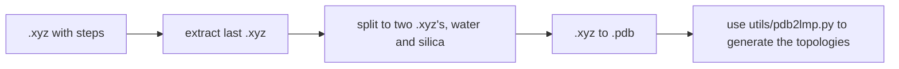

# cassandra2lmp

Simple code to convert a .xyz file to lammps topology. It basically guess the bonds and angles using cassadra. Bonds and angles with same atomic number are ignored (H-H or O-O are ignored, H-O-H works fine).

The current code pipeline is:

